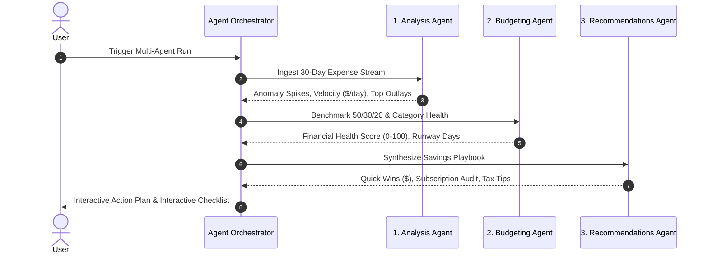

<div align="center">

# ⚡ LEDGER — AI EXPENSE TRACKER & FINANCIAL INTELLIGENCE OS

### Production-grade AI Financial Assistant, Receipt OCR Extraction, RAG Vector Search & 3-Agent Optimization Workflow

[](https://www.typescriptlang.org/)
[](https://react.dev/)
[](https://tailwindcss.com/)
[](https://expressjs.com/)
[](https://www.prisma.io/)
[](https://www.docker.com/)

</div>

---

## 🌟 Key Features

- 🔐 **User Authentication**: Secure JWT-based authentication with bcrypt password hashing, input validation via Zod, and instant demo login capability.
- 💳 **Complete Expense Tracking**: Categorized transaction ledger with search, filtering, custom date ranges, payment method tracking, recurring auto-charges, and CSV exports.
- 🧾 **AI Receipt OCR & Ingestion**: Drag & drop receipt and invoice upload (PNG, JPG, PDF, TXT) with automatic extraction of merchant, date, total, tax, and itemized line items.
- 🧠 **RAG (Retrieval-Augmented Generation)**: Automatic document chunking and vector indexing over receipts and bank statements. Natural language question answering with exact source citations and similarity scores.
- 🤖 **Multi-Agent Optimization Workflow**:
  1. **Analysis Agent**: Detects spending velocity, anomaly spikes, recurring subscription commitments, and MoM variance.
  2. **Budgeting Agent**: Evaluates 50/30/20 guideline adherence, calculates 0–100 Financial Health Score, category overages, and cashflow runway days.
  3. **Recommendations Agent**: Synthesizes prioritized money-saving quick wins, subscription audits, tax optimization advice, and an interactive action plan checklist.
- 📊 **Fintech Dashboard**: Interactive Recharts visualizations including 30-day Spending Velocity Area Charts, Category Breakdown Donut Charts, Budget vs Actual progress bars, and real-time AI Insights.
- 🎯 **Category Budget Guardrails**: Set custom monthly budget limits with dynamic percentage alert thresholds.
- 🚀 **Zero-Config Execution**: Works out-of-the-box with SQLite and local heuristic fallback, with optional seamless switching to OpenAI, Claude, and PostgreSQL via Docker Compose.

---

## 🏗️ Architecture

```
ledger/
├── client/                      # React 19 + TypeScript + Vite Frontend
│   ├── src/
│   │   ├── components/          # Reusable UI & specialized finance widgets
│   │   │   ├── common/          # Buttons, Modals, Badges, Dropzone, Skeletons
│   │   │   ├── dashboard/       # KPI Stats, Area Chart, Donut Chart, Budgets
│   │   │   ├── expenses/        # Expense Table, Form Modal, Filter Bar
│   │   │   ├── receipts/        # Receipt Cards, Detail Modal, Upload Dropzone
│   │   │   ├── assistant/       # Chat Window, Message Bubbles, Citations
│   │   │   ├── agents/          # Workflow Stepper, Health Score Gauge, Action Plan
│   │   │   └── budgets/         # Budget Cards, Set Budget Modal
│   │   ├── pages/               # Dashboard, Expenses, Receipts, Assistant, Reports, Budgets
│   │   ├── services/            # Axios API service integrations
│   │   ├── context/             # Auth Context & Session Management
│   │   └── types/               # Full TypeScript interfaces
│   └── package.json
│
├── server/                      # Express + Node.js + Prisma Backend
│   ├── src/
│   │   ├── ai/
│   │   │   ├── llm/             # Unified LLM Provider (OpenAI, Claude, Local Fallback)
│   │   │   ├── rag/             # Chunker, Document Loader, Retriever & Pipeline
│   │   │   ├── embeddings/      # Vector Embeddings & Cosine Similarity
│   │   │   ├── vectorstore/     # In-memory vector index / ChromaDB
│   │   │   ├── prompts/         # Structured System & Agent Prompts
│   │   │   └── agents/          # Analysis, Budgeting & Recommendations Agents
│   │   ├── controllers/         # REST Controllers
│   │   ├── routes/              # Express API Routes
│   │   ├── services/            # Business Logic & DB Transactions
│   │   ├── prisma/              # Schema & Database Seeder
│   │   └── server.ts            # Server Entry Point
│   └── package.json
│
├── docker/                      # Docker configurations (PostgreSQL, ChromaDB)
├── docs/                        # Architecture diagrams & REST API documentation
├── docker-compose.yml           # Full-stack Multi-Container Deployment
└── README.md
```

---

## 🚀 Quick Start (Local Development)

### 1. Prerequisites
- **Node.js** >= 18.x
- **npm** >= 9.x

### 2. Backend Setup
```bash
cd server
npm install

# Initialize Database & Seed Demo Data
npm run prisma:push
npm run prisma:seed

# Start Backend Server (runs on http://localhost:5000)
npm run dev
```

### 3. Frontend Setup
```bash
# In a new terminal
cd client
npm install

# Start Vite Frontend (runs on http://localhost:5173)
npm run dev
```

### 4. Open in Browser
Visit `http://localhost:5173` and log in with the pre-seeded demo account:
- **Email**: `alex@ledger.io`
- **Password**: `password123`
*(Or click the "One-Click Instant Demo Login" button)*

---

## 🐳 Docker Deployment

To launch the complete production stack (PostgreSQL, ChromaDB, Backend Server, and Frontend Nginx) with a single command:

```bash
# Start all containers
docker-compose up --build -d

# Open the app at http://localhost
```

---

## ⚙️ Environment Configuration

Create a `.env` file in `server/` (or copy `.env.example`):

```env
PORT=5000
NODE_ENV=development
JWT_SECRET=your_super_secret_jwt_key
DATABASE_URL="file:./dev.db"
CLIENT_URL=http://localhost:5173

# AI Configuration (Optional: runs smart local heuristic engine if keys are omitted)
LLM_PROVIDER=mock # options: openai | claude | mock
OPENAI_API_KEY=sk-...
ANTHROPIC_API_KEY=sk-ant-...
```

---

## 🤖 Multi-Agent Financial Optimization Workflow



---

## 📚 API Reference

See the full [REST API Documentation](docs/api.md) for endpoint schemas, request bodies, and sample responses.

---

## 📄 License
This project is licensed under the MIT License.
