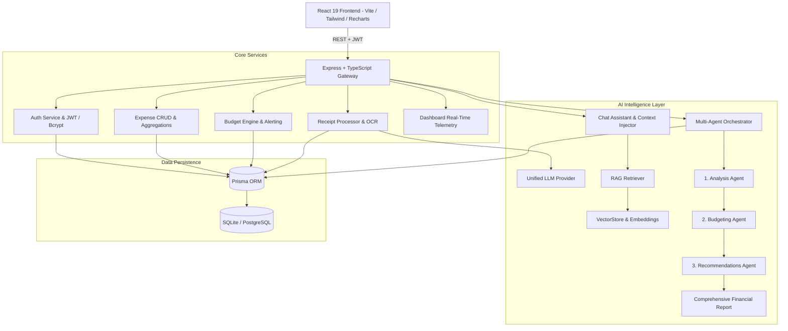
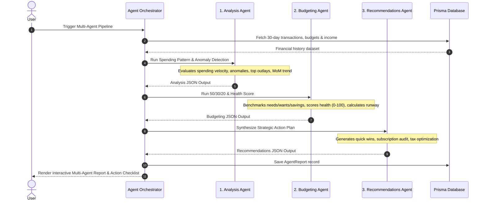

# Ledger Architecture & Multi-Agent Financial Workflow

## System Architecture

```mermaid
graph TD
    Client[React 19 Frontend - Vite / Tailwind / Recharts] -->|REST + JWT| API[Express + TypeScript Gateway]
    
    subgraph Core Services
        API --> Auth[Auth Service & JWT / Bcrypt]
        API --> ExpenseSvc[Expense CRUD & Aggregations]
        API --> BudgetSvc[Budget Engine & Alerting]
        API --> ReceiptSvc[Receipt Processor & OCR]
        API --> DashSvc[Dashboard Real-Time Telemetry]
    end

    subgraph AI Intelligence Layer
        ReceiptSvc --> LLMFactory[Unified LLM Provider]
        API --> ChatSvc[Chat Assistant & Context Injector]
        ChatSvc --> RAG[RAG Retriever]
        RAG --> VectorStore[VectorStore & Embeddings]
        
        API --> MultiAgent[Multi-Agent Orchestrator]
        MultiAgent --> Step1[1. Analysis Agent]
        Step1 --> Step2[2. Budgeting Agent]
        Step2 --> Step3[3. Recommendations Agent]
        Step3 --> Report[Comprehensive Financial Report]
    end

    subgraph Data Persistence
        Auth --> Prisma[(Prisma ORM)]
        ExpenseSvc --> Prisma
        BudgetSvc --> Prisma
        ReceiptSvc --> Prisma
        MultiAgent --> Prisma
        Prisma --> SQLite[(SQLite / PostgreSQL)]
    end
```

## Multi-Agent Workflow Specification

```mermaid
sequenceDiagram
    autonumber
    actor User
    participant Orch as Agent Orchestrator
    participant Analysis as 1. Analysis Agent
    participant Budget as 2. Budgeting Agent
    participant Recom as 3. Recommendations Agent
    participant DB as Prisma Database

    User->>Orch: Trigger Multi-Agent Pipeline
    Orch->>DB: Fetch 30-day transactions, budgets & income
    DB-->>Orch: Financial history dataset
    
    Orch->>Analysis: Run Spending Pattern & Anomaly Detection
    Note over Analysis: Evaluates spending velocity, anomalies, top outlays, MoM trend
    Analysis-->>Orch: Analysis JSON Output
    
    Orch->>Budget: Run 50/30/20 & Health Score
    Note over Budget: Benchmarks needs/wants/savings, scores health (0-100), calculates runway
    Budget-->>Orch: Budgeting JSON Output
    
    Orch->>Recom: Synthesize Strategic Action Plan
    Note over Recom: Generates quick wins, subscription audit, tax optimization
    Recom-->>Orch: Recommendations JSON Output
    
    Orch->>DB: Save AgentReport record
    Orch-->>User: Render interactive Multi-Agent Report & Action Checklist
```
